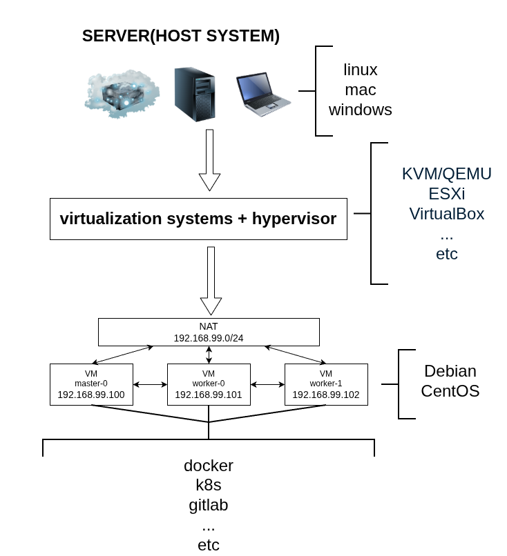
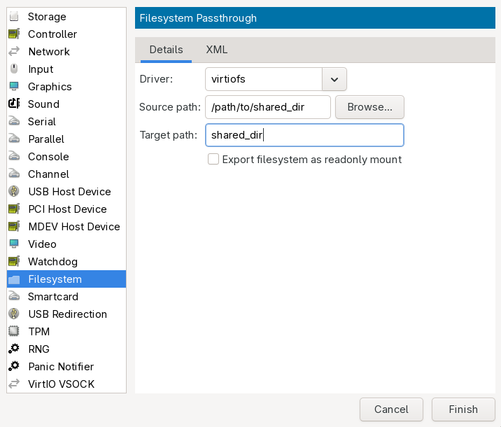

# ЛАБОРАТОРНАЯ №1. Подготовка рабочего окружения

## Возможные ошибки при выполнении задания

permission denied по достижении этапа развертывания доменов.

Нужно отключить apparmor.service полностью или добавить в исключения libvirt

* [Apparmor ](https://itsfoss.gitlab.io/post/how-to-enable-or-disable-apparmor-on-ubuntu-2404-2204-or-2004/)

```
## Отключение apparmor
# systemctl disable --now apparmor.service
# systemctl mask apparmor.service
# reboot
```

## Требования:

1) Подготовить ПК с хостовой OS Linux, поставить второй системой. Использовать дистрибутив Debian stable ( https://www.debian.org/distrib/netinst ).
   Под диск **>=150gb**. Выбрать установку
   * **standart system utilities**

   Выбрать графическое окружение по желанию.
   Чтобы сэкономить ресурсы можно выбрать самое легкое графическое окружение - **Xfce**.
   Остальные пункты убрать.


> P.S Для тех у кого уже есть устройство с Linux/Mac или другой вариант где у вас получится развернуть `3 ВМ`, то делайте как привыкли и как вам удобнее.
   Так или иначе для данного курса Windows и VirtualBox использовать не рекомендую.
   В таком случае цель для вас, это создание и настройка трех ВМ, характеристики адаптировать из файла `terraform.tfvars`
   Не забудьте создать отдельную `NAT сеть` в вашей системе виртуализации.
   А также присвоить машинам `статические ip адреса` при их настройке.
   `hostname` машин должен отличаться.
   Также для некоторых инструментов понадобится сделать `port forward`.
>

   **!! Ниже команды и шаги которые подходят под рекомендуемый вариант, а именно Debian и KVM+QEMU+Libvirt. !!**

## Topology


2) Установить пакеты на хост, настроить и запустить libvirt, проверить что все работает.
```
$ su -  # сменить пользователя ( root )

# apt install -y qemu-system-x86 \
                 virtiofsd \
                 libvirt-daemon-system \
                 libvirt-clients \
                 bridge-utils \
                 virtinst \
                 virt-manager \
                 xorriso \
                 whois \
                 htop \
                 git \
                 curl \
                 unzip \
                 wget \
                 ssh  # установка пакетов

# systemctl enable --now libvirtd.service  # запуск демона libvirt

# virt-host-validate qemu # проверка работы. Вывод команды должен быть примерно такой как ниже, значит ок
  QEMU: Checking for hardware virtualization                                 : PASS (SVM)
  QEMU: Checking if device '/dev/kvm' exists                                 : PASS
  QEMU: Checking if device '/dev/kvm' is accessible                          : PASS
  QEMU: Checking if device '/dev/vhost-net' exists                           : PASS
  QEMU: Checking if device '/dev/net/tun' exists                             : PASS
  QEMU: Checking for cgroup 'cpu' controller support                         : PASS
  QEMU: Checking for cgroup 'cpuacct' controller support                     : PASS
  QEMU: Checking for cgroup 'cpuset' controller support                      : PASS
  QEMU: Checking for cgroup 'memory' controller support                      : PASS
  QEMU: Checking for cgroup 'devices' controller support                     : WARN (Enable 'devices' in kernel Kconfig file or mount/enable cgroup controller in your system)
  QEMU: Checking for cgroup 'blkio' controller support                       : PASS
  QEMU: Checking for device assignment IOMMU support                         : PASS (IVRS)
  QEMU: Checking if IOMMU is enabled by kernel                               : PASS
  QEMU: Checking for secure guest support                                    : WARN (None of SEV, SEV-ES, SEV-SNP, TDX available)

# usermod -aG libvirt $(id -un 1000) # настроить возможность взаимодействия с URI qemu:///system от пользователя, обычно id=1000 ваш пользователь, но можно указать явно имя пользователя вместо $(id -un 1000)

# mkdir -p /var/lib/libvirt/isos/ && curl -LO https://cloud.debian.org/images/cloud/trixie/latest/debian-13-generic-amd64.qcow2 --output-dir /var/lib/libvirt/isos/ # загрузить cloudinit образ на хост

# exit

$ virsh -c qemu:///system list --all # открыть новый терминал и проверить что команда выполняется от пользователя без ошибок
```

3) Выполнить команду для генерации пары ключей
```
$ ssh-keygen -t ed25519 -f ~/.ssh/id_ed25519 -N ""
```

4) Склонировать репозиторий с заданиями, перейти в директорию с лабораторной.
   Запустить сценарий для установки terraform и libvirt provider
```
$ mkdir ~/work
$ git clone --depth=1 https://github.com/itomilin/devops_course.git ~/work/devops_course
$ cd ~/work/devops_course/LAB_1
$ ./prepare.sh
```

5) Проверить работу terraform и развернуть виртуальные машины.
   В файле `terraform.tfvars` нужно подставить `root_pswd_hash` ( команда генерации указана ),
   опционально можете изменить конфигурацию виртуальных машин (cpu, ram), диск лучше не трогать.
```
$ cd ~/work/devops_course/LAB_1/src
$ terrafom plan
$ terraform apply -auto-approve

## команду ниже использовать для очистки всего и только если проблемы на этапе terraform apply. Т.к удаляет все ресурсы, включая !!файловую систему ВМ!!
$ terraform destroy
```

6) Создание и настройка виртуальных машин займет некоторое время ( обычно пару минут ), зависит от системы.
   После процесса инициализации ВМ будет перезагружена.
   Узнать закончился ли процесс инициализации можно по наличию файла **/root/cloudinit.txt**, примерное содержимое файла показано ниже:
```
$ su -
# cat /root/cloudinit.txt
end Mon Feb  9 15:56:59 MSK 2026
status: running
extended_status: running
boot_status_code: enabled-by-generator
last_update: Thu, 01 Jan 1970 00:00:11 +0000
detail: DataSourceNoCloud [seed=/dev/sr0]
errors: []
recoverable_errors: {}
```

   Для просмотра/управления/конфигурации ВМ машин есть утилиты:
   * **virt-manager** ( UI )
   * **virsh** ( CLI )

   После того как машины будут созданы, можно подключиться к ним по ssh.
```
$ virt-manager

# ниже пару команд, которые показывают примеры взаимодействия с CLI утилитой
# virsh -c qemu:///system <cmd> <opts>
$ virsh -c qemu:///system list --all
$ virsh -c qemu:///system net-list --all
$ virsh -c qemu:///system pool-list --all

# IP adresses по умолчанию
$ ssh debian@192.168.99.100 # master0
$ ssh debian@192.168.99.101 # worker0
$ ssh debian@192.168.99.102 # worker1
```

## Libvirt shared fs
* [Libvirt shared dir](https://libvirt.org/kbase/virtiofs.html)

Выбираем нужную VM в virt-manager, жмем на `VM hardware details`, затем `Add hardware` и заполняем своими значенями.



После этого остановить и запустить VM, после входа в систему примонтировать диск:
```
# <target_path> <path_to_mount> virtiofs defaults 0 0
shared_dir /home/debian/work virtiofs defaults 0 0 # добавить запись в /etc/fstab

# systemctl daemon-reload
# mount -a # команда чтобы примонтировать все что в /etc/fstab
```

## При показе выполненного задания
   * Запустить все ВМ
   * Подключиться к ним по ssh
   * Выполнить ping между машинами в их сети
   * Выполнить ping на любой адрес во внешнюю сеть

