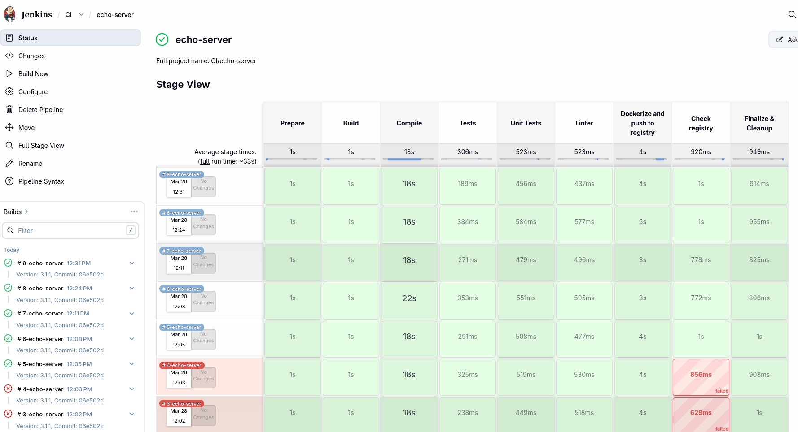
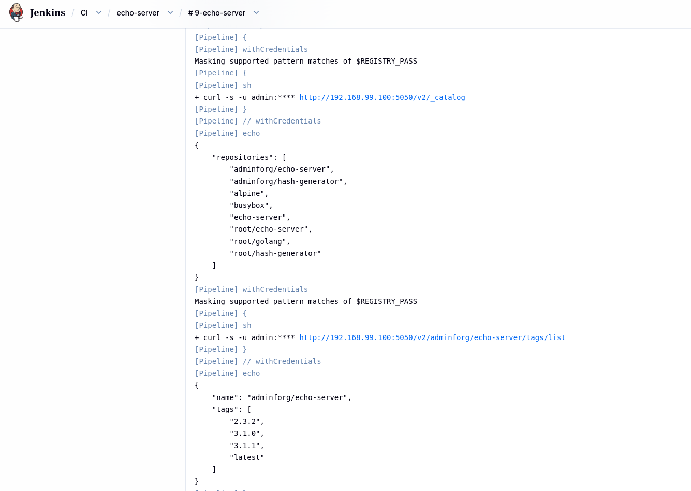

# ЛАБОРАТОРНАЯ №3. SCM, Continuous Integration. (Gitlab, Jenkins)

## Docs

* [Gitlab docs](https://docs.gitlab.com/)
* [Runner creation](https://docs.gitlab.com/tutorials/automate_runner_creation)
* [Forgejo installation](https://forgejo.org/docs/next/admin/installation/docker/)

## Возможные ошибки при выполнении задания

Если на этапе `dockerize` при команде `docker login` возникает ошибка

```
Error response from daemon: Get "http://192.168.99.100:5050/v2/": Get "http://gitlab:80/jwt/auth?account=gitlab-ci-token&client_id=docker&offline_token=true&service=container_registry": dial tcp: lookup gitlab: no such host
```

тогда добавить строку `registry['token_realm'] = "192.168.99.100:80"` в конец файла ./cfg/gitlab.rb

Затем сделать полную остановку и старт контейнера с гитлабом и применить конфигурацию:
```
$ docker compose down gitlab
$ docker compose up -d gitlab

# дождаться запуска gitlab и выполнить reconfigure
$ docker exec gitlab gitlab-ctl reconfigure
```

##
Цель задания подготовить пайплайн в CI системе для сборки своих сервисов и загрузке их в registry.

Второй вариант выбирать предпочтительнее т.к гибкий, быстро работает и запускается, мало потребляет ресурсов.<br>Для слабых систем, с <=8 Gb RAM только второй вариант.

## Предварительные действия
Подключиться к ВМ master-0.

Добавить файл `daemon.json` в `/etc/docker/` и перезапустить докер.
```
$ su -
# cp /home/$(id -un 1000)/work/devops_course/LAB_3/daemon.json /etc/docker/daemon.json
# systemctl restart docker.service
# exit
```


# Первый вариант (Gitlab)

## 1) Развернуть Gitlab

Перейти в директорию gitlab:
```
$ cd ~/work/devops_course/LAB_3/gitlab
```

Сгенерировать `.env` содержащий все необходимые переменные:
```
$ ./scripts/prepare_env.sh
```

Развернуть Gitlab:
```
$ docker compose up -d gitlab
```

Инициализация займет некоторое время, все последующие запуски будут быстрее.

После инициализации открыть с хоста адрес http://192.168.99.100:80/ и проверить работу Gitlab, данные для входа:
```
login: root
password: GITLAB_ROOT_PASSWORD field from .env
```

* (Опционально) Перейти http://192.168.99.100/admin/users и создать пользователя
* (Опционально) Перейти http://192.168.99.100/-/user_settings/ssh_keys и добавить публичный ssh ключ (удобнее чем http метод).
* Создать репозиторий для вашего приложения http://192.168.99.100/projects/new#blank_project и загрузить приложение в Gitlab

## 2) Развернуть Registry
Использовать встроенное registry в gitlab мы не будем, поэтому развернем свое минималистичное.

По умолчанию в репозитории лежит зашифрованный файл `.registry_auth` для `docker-registry`, creds:
```
user: admin
password: pass
```
Файл сгенерирован следующим образом:
```
htpasswd -Bbn <user> <pass> > .auth
```
Утилита требует установки пакета `apache2-utils` (debian based distro).
Логин и пароль можно оставить по умолчанию и не менять.

Для развертывания выполнить команду:
```
$ docker compose up -d registry
```

Это минимальный registry, у него нету интегрированного UI, смотреть содержимое можно через API.<br>
Для нас достаточно смотреть список загруженных образов и их тегов, изначально он будет пустым.<br>После запуска, можно сделать проверку все ли корректно развернулось:
```
curl -s -u <user>:<pass> http://192.168.99.100:5050/v2/_catalog | json_pp
```
Если все ок, то отдаст пустой список реп:
```
{
   "repositories" : []
}
```
Или отправить запрос через адресную строку браузера (ниже примеры запросов к API для моих репозиториев):
```
# get repos
http://192.168.99.100:5050/v2/_catalog

# get repo tags
http://192.168.99.100:5050/v2/root/echo-server/tags/list
http://192.168.99.100:5050/v2/root/hash-generator/tags/list

# get manifest + digest (Docker-Content-Digest header)
http://192.168.99.100:5050/v2/root/echo-server/manifests/3.1.0
```
Затем логинимся в registry, чтобы сгенерировался файл `config.json`:
```
docker login 192.168.99.100:5050
```
Забираем creds:
```
cat ~/.docker/config.json
```
Добавляем их в глобальную переменную для всех проектов `gitlab`, открываем:
```
http://192.168.99.100/admin/application_settings/ci_cd
```
Жмем `Add variable`-> выбираем `Type` -> `file` -><br>
В поле `Key` вводим `DOCKER_CONFIG_JSON` -><br>
В поле `Value` вводим все содержимое из файла `~/.docker/config.json`<br>
Жмем `Add variable`

## 3) Создать и запустить runner

   * Перейти http://192.168.99.100:80/-/user_settings/personal_access_tokens
   * Нажать на `Add new token`
   * Указать имя, время жизни, права на `api`, `create_runner`
   * Нажать `Create personal access token`
   * Скопировать токен и подставить его в переменную `PERSONAL_ACCESS_TOKEN` в файле `.env`
   * Убедиться, что в `docker-compose.yaml` `IS_REGISTER_RUNNER: true` и запустить `docker compose up runner`
   * После регистрации, остановить контейнер нажатием `ctrl c`
   * Убедиться, что в docker-compose.yaml `IS_REGISTER_RUNNER: false` и запустить в фоне `docker compose up -d runner`
   * Проверить что runner появился в списке http://192.168.99.100:80/admin/runners

## 4) Написать `.gitlab-ci.yml` для своего приложения
Манифест должен включать следующие этапы:
* `Build stage`, этап сборки
* `Test stage`, этап тестов (unit tests, sast, codestyle, ...) можно сделать просто заглушками
* `Dockerize stage`, этап упаковки приложения в образ и загрузки образа в registry

Пример `.gitlab-ci.yml` манифестов в директории `applications/*`

## 5) Запуск пайпа и проверка registry
Запустить пайплайн `ui` -> `your project` -> `build` -> `pipelines` -> `run pipeline` дождаться завершения и sроверить что все этапы завершились без ошибок.

Проверить что образ появился в registry сделав запрос к API.

# Альтернативный вариант (Forgejo, docker regitry/Nexus, Jenkins)

В файлe `.env` указаны логины/пароли по умолчанию, которые используются для этого стека инструментов.<br> Их можно не менять.

## 1) Развернуть Forgejo

Перейти в директорию jenkins:
```
$ cd ~/work/devops_course/LAB_3/jenkins
```

Выполнить команду для развертывания SCM:
```
$ docker compose up -d forgejo
```

Если инициализация прошла успешно, SCM будет доступна по адресу:<br>
[http://192.168.99.100:81/](http://192.168.99.100:81/)

После инициализации создать пользователя:
```
$ docker exec -u 1000:1000 forgejo create_admin_user.sh
```

Затем выполнить вход и добавить ssh ключ, после запушить свои репозитории с исходным кодом в Forgejo.

## 2) Развернуть Registry

Подробное описание в варианте для Gitlab.

Для развертывания registry выполнить команду:
```
$ docker compose up -d registry
```

## 3) Развернуть Jenkins

`Jenkins` будем разворачивать минимальный, только необходимые плагины.<br>
Сборка будет на мастер узле в docker, без дополнительных `Jenkins agents`.<br>

Для развертывания выполнить команду:
```
$ docker compose up -d jenkins
```

Все максимально автоматизировано.
Плагины, пользователь, интеграции, все настраивается автоматически при первом запуске.

Если инициализация прошла успешно, Jenkins будет доступен по адресу:<br>
[http://192.168.99.100:82/](http://192.168.99.100:82/)

## 4) Написать манифест и выполнить сборку своего сервиса

В Jenkins используется `scripted` и `DSL` подходы или их микс.<br>
В директории есть сборочный файл `build.groovy`, можете взять его за основу, чтобы создать CI для своего сервиса.<br>
Запуск джоб мануальный, сборки по триггерам можно не настраивать.

После авторизации перейти в:<br>
[http://192.168.99.100:82/job/CI/](http://192.168.99.100:82/job/CI/)<br>

Нажать `New Item`<br>
Ввести имя джобы для сборки вашего сервиса в поле `Enter an item name`<br>
Выбрать `Pipeline` -> `Ok`<br>
В `Pipeline script` скопировать содержимое файла `build.groovy`, предварительно поменяв манифест под свой сервис<br>
Затем нажать `Save`<br>
Выйти из конфигурации джобы и нажать на `Build now`.<br>

Смотреть лог можно нажав на номер задачи, затем `Console Output`.<br>
Если джоба падает с ошибками, то смотреть лог и разбираться в причине ошибки.<br>

Ниже показан пример успешных сборок и сборок с ошибками на этапах:


После можно проверить registry на наличие в нем собранного образа.<br>
Также для удобства добавлен этап, который делает запрос к API registry, чтобы смотреть сразу в логе:


## Перенос образов в локальное registry

С помощью утилиты `skopeo` можно переносить образы из `public registry` в свое `private registry`:

Установить пакет:
```
# apt install skopeo --no-install-recommends --no-install-suggests
```

Указываем сначала `source` откуда скачивать, затем `destination` куда загружать.<br>Есть различные опции, некоторые из них в примере ниже (могут понадобиться права суперпользователя):
```shell
# --src-creds="<user>:<pass>"
skopeo copy \
  --override-os=linux \
  --override-arch=amd64 \
  --dest-tls-verify=false \
  --dest-creds=<user>:<pass> \
  docker://busybox:1.37.0-musl \
  docker://192.168.99.100:5050/busybox:1.37.0-musl
```
Таким образом можно зеркалировать docker repository в свое registry.

## При показе выполненного задания
   * Продемонстрировать успешное развертывание выбранных инструментов
   * Написать сборочный манифест. Собрать приложение несколько раз с разными тегами (нужно внести какие-то изменения в ваше приложение), запустить пайплайн и дождаться окончания сборки
   * Склонировать образы из registry и запустить их, убедиться что все собрано правильно и сервис работает.

