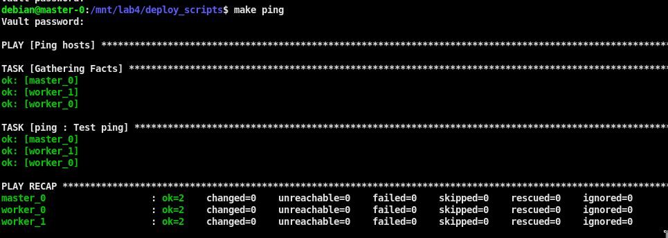
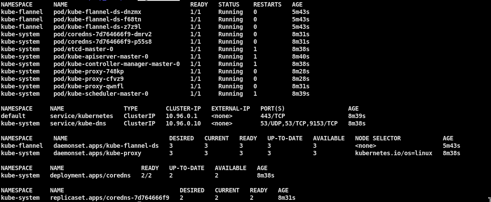
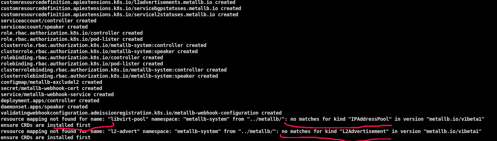
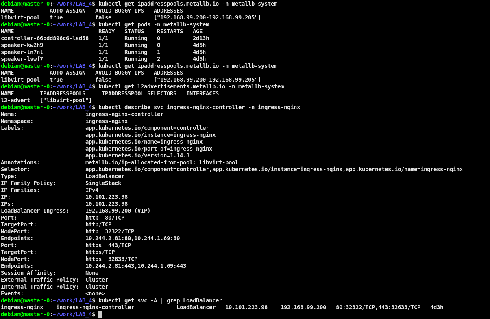
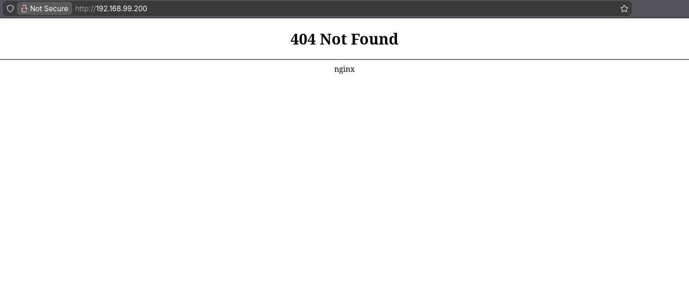
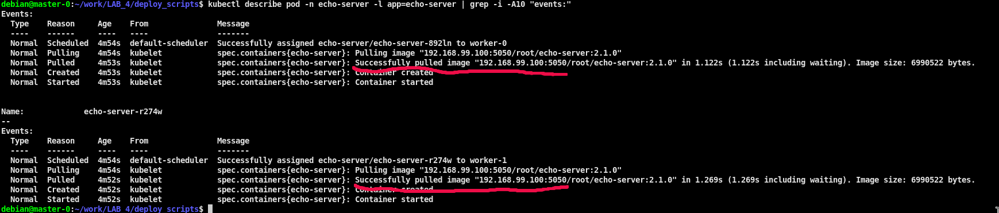

# ЛАБОРАТОРНАЯ №4. Infrastructure as Code (IaC), Ansible

## Docs

* [Ansible Documentation](https://docs.ansible.com/ansible/latest/index.html)
* [Ansible Using variables](https://docs.ansible.com/ansible/latest/playbook_guide/playbooks_variables.html)
* [Ansible Best Practices](https://docs.ansible.com/projects/ansible/2.9/user_guide/playbooks_best_practices.html)
* [Jinja2 templates ](https://jinja.palletsprojects.com/en/3.1.x/)
* [Ansible user repository](https://galaxy.ansible.com/ui/)
* [Kubernetes Installing kubeadm](https://kubernetes.io/docs/setup/production-environment/tools/kubeadm/install-kubeadm/)
* [Kubernetes Creating a cluster with kubeadm](https://kubernetes.io/docs/setup/production-environment/tools/kubeadm/create-cluster-kubeadm)
* [Kubespray](https://github.com/kubernetes-sigs/kubespray)
## Популярные клиенты для управления кластером
* [k9s](https://github.com/derailed/k9s)
* [freelens](https://github.com/freelensapp/freelens)

## Возможные ошибки при установке

Если что-то идет не так и на этапе установки k8s возникают ошибки, то можно очистить систему:

```
$ make reset_k8s   # остановка кластера + удаление + очистка конфигураций k8s
$ make install_k8s k8s_install_tags="k8s_kube_init,k8s_kube_join,k8s_approve_certs,k8s_add_network_plugin" # набор тегов для повторной инициализации k8s
$ make cleanup_k8s # остановка кластера и полная очистка включая установленные пакеты
```

Если coredns не может запуститься, можно попробовать удалить поды (перезапустятся после удаления автоматически) и проверить статус еще раз
```
$ k delete -n kube-system pod coredns-<hash> coredns-<hash>
```

Проблемы с разрешением DNS адресов на IPv4
```
В k8s/vars/main.yml уже выставленны значения для отключения резолвера(systemd-resolved) и IPv6.

k8s_disable_ipv6: true
k8s_disable_systemd_resolved: true
```


# Требования

Использовать ansible для развертывания kubernetes кластера, простой вариант без high availability (HA), будет состоять из одного master узла, и двух worker узлов, который подготовили на предыдущих этапах.

Обычно ansible-playbook для настройки окружений запускается с отдельной машины, изолированой от настраиваемого окружения, но в нашем случае будет запускаться с master-0.
Поэтому сначала необходимо подготовить master-0

1) Подключиться по ssh к ВМ master-0.
   Перейти в директорию с заданием и выполнить следующие команды:

```
$ su -
# cd /home/$(id -un 1000)/work/devops_course/LAB_4/deploy_scripts
# ./scripts/install_ansible.sh
# exit
$ source ~/.bashrc
$ ansible-playbook --version
```

2) Настроить подключение по ключам к ВМ.

* На master-0 создать пару ключей `$ ssh-keygen -t ed25519 -f ~/.ssh/id_ed25519 -N ""`
* Скопировать содержимое файла `cat ~/.ssh/id_ed25519.pub`, подключиться с хоста на worker-0,1 добавить в конец файла `~/.ssh/authorized_keys` (поскольку в LAB_1 пользователь создается без пароля и вход только по ключам)
* **Альтернативный способ**, скопировать ключи с вашего хоста и добавить их в директорию `~/.ssh` на master-0, указать права `chmod 0600 ~/.ssh/id_ed25519` (доступ по ключам будет настроен, при условии что pubkey уже был добавлен на ВМ в `authorized_keys`)

3) Создать файл с паролями `./inventories/dev/group_vars/all/secrets.yml`.
   По умолчанию редактор может быть **vim**, поэтому можно добавить переменную `EDITOR=<your_editor>`

* Создание: `EDITOR=nano ansible-vault create ./inventories/dev/group_vars/all/secrets.yml`
* Редактирование: `EDITOR=nano ansible-vault edit ./inventories/dev/group_vars/all/secrets.yml`

```
# содержимое файла `secrets.yml`, названия переменных не менять т.к. они используются в манифестах.
master_0_root_pass: "<your_password>"
worker_0_root_pass: "<your_password>"
worker_1_root_pass: "<your_password>"
```

4) Изменить значения в `ansible.cfg` (eсли требуется). Проверить доступность хостов с помощью команды:

```
$ make ping
```

Если все ок, то вывод будет таким


5) Отредактировать значения переменных (если нужно) в файле `./roles/k8s/vars/main.yml`
   После этого развернуть k8s:

```
$ make install_k8s # Полная установка. Запустит все теги, доступные в k8s role
# опционально. Если понадобится выборочный запуск с использованием тегов
$ make install_k8s k8s_install_tags="k8s_debug_get_all" # Запускает только перечисленные теги из k8s role
$ make install_k8s k8s_install_tags="k8s_prerequisites,k8s_check_required_ports" # Перечисление через запятую без пробелов. Запуск в порядке указания
```

6) После развертывания kubernetes выполнить сценарий:

```
$ ./scripts/add_kubectl_alias.sh
$ source ~/.bashrc
```

   Проверить работу кластера, например следующими командами:

* k cluster-info
* k get nodes
* k get all -A

Вывод команды `k get all -A`, обратить внимание на READY и на RESTARTS (количество не должно возрастать после старта кластера)



7) Установить helm

```
$ make helm_install
$ helm version # проверить установку helm
```

8) Запустить metallb и ingress controller

```
$ k apply -k ../ingress-controller
$ ../metallb/patch_strictARP.sh
$ k apply -k ../metallb

# Проверить, что появились поды и они работают + CRD
$ k get pods -n metallb-system
$ k get ipaddresspools.metallb.io -n metallb-system
$ k get l2advertisements.metallb.io -n metallb-system
$ k describe svc ingress-nginx-controller -n ingress-nginx

# Поле под EXTERNAL-IP не должно быть в статусе pending
$ k get svc -A | grep -E "CLUSTER-IP|LoadBalancer"
```

```
# Если все получилось, то точка входа ingress будет указана в EXTERNAL-IP
kubectl get svc -n ingress-nginx
```

  Если что-то подобное будет в логе, то еще раз выполнить команду `k apply -k ../metallb`


   После проверить что metallb развернулся (extenal-ip должен быть присвоен из пула адресов)


   Перейти по адресу http://192.168.99.200/ и проверить что nginx запустился и работает


9) Добавить imagePullSecrets для своего private registry и
   запустить daemonset со своим сервисом для проверки работы registry:

```
# Запустить сценарий, предварительно изменив в нем переменные если нужно
$ ./scripts/create_registry_secret.sh

# Проверить созданный секрет следующей командой (поменять ns и название секрета, если нужно)
$ k get secrets -n <namespace> gitlab-insecure-registry -o json | jq -r '.data[".dockerconfigjson"]' | base64 -d | json_pp
```

```
# Запустить манифест, предварительно изменив в нем значения под свой сервис
$ k apply -f ../kube_files/daemonset-app.yaml
```

  Если все ок, то будет надпись об успешной загрузке образа.



```
# После удалить запущенный daemonset с помощью команды:
$ k delete -f ../kube_files/daemonset-app.yaml
```

10) *Опционально. Установить metrics-server для отображения потребления ресурсов кластера.

```
$ k apply -k ../metrics-server
```

## При показе выполненного задания
   * Продемонстрировать рабочий кластер k8s с помощью команд в п.6
   * Продемонстрировать успешную загрузку образа из вашего registry
   * Продемонстрировать работу ingress-controller
