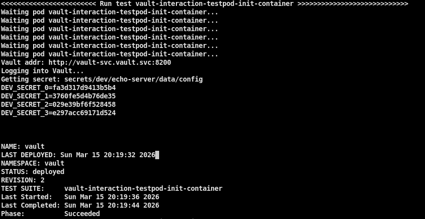

# ЛАБОРАТОРНАЯ №5. Container orchestration system. Kubernetes + Helm + HashiCorp Vault

## Docs

* [Helm](https://helm.sh/docs)
* [Helm functions](https://helm.sh/docs/chart_template_guide/function_list)
* [Kubernetes](https://kubernetes.io/docs/home/)
* [Kubernetes cluster architecture](https://kubernetes.io/docs/concepts/architecture/)
* [Vault kubernetes](https://developer.hashicorp.com/vault/tutorials/kubernetes/kubernetes-raft-deployment-guide)
* [Vault cli](https://developer.hashicorp.com/vault/docs/commands)
* [Vault Secret Operator (VSO)](https://developer.hashicorp.com/vault/tutorials/kubernetes-introduction/vault-secrets-operator?productSlug=vault&tutorialSlug=kubernetes&tutorialSlug=vault-secrets-operator)
* [VSO Secret Transformation](https://developer.hashicorp.com/vault/docs/deploy/kubernetes/vso/secret-transformation)
* [Vault Agent Injector](https://developer.hashicorp.com/vault/docs/deploy/kubernetes/injector)

# Требования

Написать k8s манифесты и развернуть в kubernetes приложения с помощью `kubectl`.
Написать простой `helm chart` для шаблонизации манифестов и повторно развернуть, но уже с помощью `helm`.
Использовать `vault` для получения секретов в pod.

Обычно управление k8s происходит через `kubectl` с отдельной машины, изолированой от окружения где развернут кластер, но в нашем случае будет запускаться с master-0. С утилитой `helm` ситуация такая же.

Утилита `kubectl` и `helm` уже должна быть установлена и настроена в лаб. №4. Чтобы не писать команду целиком `kubectl`, можно использовать alias `k`.

# 1)
В директории `examples` есть примеры манифестов.
В них используются самые основные и необходимые абстракции/контрóллеры k8s:

* namespace
* service
* pod
* replicaset
* deployment

   Поэтому вам нужно проанализировать и разобраться с их синтаксисом, затем исправить для своего окружения и приложения.

   После исправлений зайти на master-0 и попробовать запустить манифесты, самый простой способ с помощью команд:

```
$ k apply -f <path_to_manifest> # применить конфигурацию
$ k delete -f <path_to_manifest> # удалить созданные ресурсы
```

   Для ознакомления сделать all-in-one deployment содержащий service, pod, ns, rs.

   После развертывания сделать запросы к своему сервису, убедиться что приходит ответ.

# 2)
Развернуть систему хранения секретов `vault` и разобраться с этим инструментом. Hастроить, добавить секреты, получить секреты и продемонстрировать что они получены
(например зайти в pod и посмотреть содержимое .env файла или env переменных)

## На master-0 перейти в директорию с chart
```
$ cd ~/work/LAB_5/helm/vault
```

## Запустить сценарий (создаст ns, директорию на fs и pv)
```
./scripts/setup_vault.sh
```

## Установить chart и дождаться инициализации
```
$ helm upgrade --install -n vault vault .
$ k logs -n vault pods/vault-0 -f
```

## Зайти в под и запустить сценарии (предварительно поменять значения на свои ./helm/templates/configmap.yaml)
```
$ k exec -it -n vault vault-0 -- /bin/sh
$ /vault/scripts/create_users.sh
$ /vault/scripts/create_secrets.sh
$ /vault/scripts/upsert_auth_method.sh
```

## Сгенерированные keys и root token
```
$ k exec -it -n vault vault-0 -- /bin/sh -c "cat /mnt/vault_data/keys"
```

## Добавить к себе на хост запись в /etc/hosts и перейти по адресу для проверки
```
192.168.99.200 vault.test.local
```

Если все ок, то в UI будет видно созданные секреты.

# 3)
Выбрать один из способов для получения секретов из `vault`, после проверить работоспособность для выбранного способа с помощью тестов (тот способ который выбрали на этом этапе, использовать в п.4)

  Есть три варианта получения секретов из `vault`:
* `REST API` реализация на основе собственного `init container` # inject только в файл, невозможен inject в env без изменения entrypoint
* `vault agent inject`  # inject только в файл, невозможен inject в env без изменения entrypoint
* `vault secret operator`  # inject и в env переменные и в файл

!!В примере чарта `application` на данный момент реализован `REST API` и `VSO`!!

## REST API Init Container
#### Для тестов включен по умолчанию

## Vault Agent Injector (реализация только в tests chart vault)

#### Для vault agent inject сначала надо сгенерировать ключи
```
helm template -n vault vault ./helm/vault --set injector.enabled=true -s templates/injector-secret.yaml
```

#### Подставить сгенерированные значения в values.yaml, включить injector
```
certs:
  secretName: vault-agent-injector-certs
  keyName: <tls.key_helm_render>
  certName: <tls.crt_helm_render>
  caBundle: <ca.crt_helm_render>
injector.enabled: true
```
#### Сделать helm upgrade
```
$ helm upgrade --install -n vault vault ./helm/vault
```

## Vault Secret Operator

#### Применить CRD
```
$ k apply -k ./vault-secrets-operator/
```
#### Создать ns
```
$ k create ns vso
```
#### Сделать helm upgrade
```
$ helm upgrade --install --set vso.enabled=true -n vault vault ./helm/vault
```


## Запуск тестов для проверки получения секретов в pod (предварительно убрать лишние тесты из списка в скрипте)
```
$ helm upgrade --install --set testPod.enabled=true -n vault vault ./helm/vault
$ ./scripts/run_tests.sh
```
Успешный лог должен быть примерно таким, видны переменные полученные из `vault`



#### Для отладки токена, если нужно
```
$ echo $(cat /var/run/secrets/kubernetes.io/serviceaccount/token) | cut -d '.' -f 2 | base64 -d 2>/dev/null | jq .
```

#### Удалить chart можно с помощью команды
```
$ helm uninstall -n vault vault
```

#### Полная очистка chart, pv, pvc, ns и все постоянные данные
```
$ helm uninstall -n vault vault
$ k delete ns vault
$ ./scripts/cleanup_vault_storage.sh
```

#### Если pv зависло в статусе terminating при удалении (обычно если осталось pvc), тогда
```
$ k patch pv vault-pv-0 -p '{"metadata":{"finalizers":null}}'
```

# 4)
Запустить helm chart `./helm/application` для своего собственного сервиса, предварительно поменяв значения под свои. Или создать свой чарт с нуля.

## Поправить values в чарте
```
./helm/application/values.yaml
```

## Добавить к себе на хост записи в /etc/hosts (<service_name> поменять на свое имя сервиса)
```
192.168.99.200 <service_name>.test.local
192.168.99.200 <service_name>.dev.local
192.168.99.200 <service_name>.preprod.local
192.168.99.200 <service_name>.prod.local
```

## Запустить чарт и попробовать выполнить запросы к своему сервису
```
$ helm upgrade --install -n dev <service_name> ./helm/application
curl http://<service_name>.test.local
```

## Полезные команды helm
```
# Создание структуры шаблона
$ helm create <name>

# Проверка шаблона с подставленными values (для отладки шаблонизатора)
$ helm template -n <ns> <name> <path_to_chart>

# Установка чарта
$ helm install -n <ns> <name> <path_to_chart>

# Обновление версии чарта (например изменить версию образа), правим values и обновляем
$ helm upgrade -n <ns> <name> <path_to_chart>

# Можно через --set-string указать нужные values для замены (через запятую без пробелов)
$ helm upgrade -n <ns> <name> <path_to_chart> --set-string <path_to_value>=2.3.0,<path_to_value>=5

# Пример
$ helm upgrade -n dev echo-server . --set-string app.image.tag=2.3.0,app.replicas=5

# Удалить чарт
$ helm uninstall -n dev <name>
```

#### CRD vault secret operator
```
$ k get -n <ns> vaultauth,vaultconnection,vaultstaticsecret,secrettransformation
$ k delete -n <ns> vaultauth,vaultstaticsecret,vaultconnection,secrettransformation <res_names>
```


## Полезные команды k8s
```
# Посмотреть структуру полей манифеста
k explain <controller_name> --recursive
k explain rs --recursive
k explain deploy --recursive
k explain vaultauth --recursive # crd

# Посмотреть taints на узлах
kubectl get nodes -o custom-columns=NAME:.metadata.name,TAINTS:.spec.taints

kubectl get pods -A -o custom-columns=NODE:.spec.nodeName,NAMESPACE:.metadata.namespace,POD:.metadata.name \
  --sort-by=.spec.nodeName | awk 'NR>1 && $1!=prev {print "------------------"} {prev=$1; print}'


# Показать манифест без запуска
k apply -k <path_to_manifest> --dry-run=client -o yaml

# Проброс порта
k port-forward svc/<service_name> -n <ns_name> <external_port>:<internal_port>

# Следить за событиями во всех ns кластера
k get events -A --sort-by='.lastTimestamp' -w

# Вывести потребляемые ресурсы
k top pod -n <ns_name> --sort-by=memory

# Посмотреть ресурсы
k get all,cm,secret,ing,pvc -n <ns_name>

# Показать все уникальные образы, которые запущены на данный момент
k get pods -A -o jsonpath='{.items[*].spec.containers[*].image}' | tr ' ' '\n' | sort | uniq

# Сравнить локальный ресурс (например чтобы проверить изменения) с тем который запущен в кластере
k diff -n <ns_name> -f ./<resource_file>

# Сохранить измененный манифест в файл, чтобы можно было сравнить с оригинальным
k kustomize ./<path_to_kustomize> > install.yaml

# Зайти в init-container
k exec -it -n <ns_name> pods/<pod_name> -c <init_container_name> -- /bin/sh

# Посмотреть логи init-container
k logs -f -n <ns_name> pods/<pod_name> -c <init_container_name>

# Запуск pod для отладки
k run dbg-pod --rm -it --restart=Never --image=docker.io/pnnlmiscscripts/curl-jq:1.6-10 -- /bin/bash
```

## При показе выполненного задания
* Запустить deployment и сделать запросы к сервису
* Продемонстрировать успешную настройку и доступ к vault, созданные секреты к своему сервису
* Запустить helm чарт для сервиса, продемонстрировать что секреты были
  получены из vault и успешно прочитаны сервисом.
  (например прочесть файл с переменными окружения или забрать из environment и вывести прочитанные переменные при запросе к отдельному endpoint сервиса).

