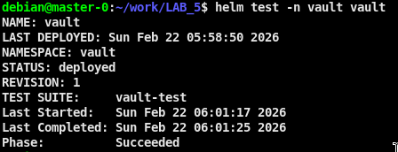
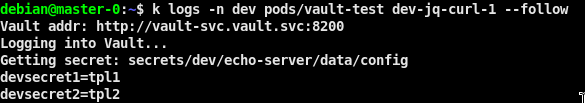

# ЛАБОРАТОРНАЯ №5. Container orchestration system. Kubernetes + Helm + HashiCorp Vault

## Docs

* [Helm](https://helm.sh/docs)
* [Helm functions](https://helm.sh/docs/chart_template_guide/function_list)
* [Kubernetes](https://kubernetes.io/docs/home/)
* [Kubernetes cluster architecture](https://kubernetes.io/docs/concepts/architecture/)
* [Vault kubernetes](https://developer.hashicorp.com/vault/tutorials/kubernetes/kubernetes-raft-deployment-guide)
* [Vault cli](https://developer.hashicorp.com/vault/docs/commands)
* [Vault Secret Operator (VSO)](https://developer.hashicorp.com/vault/tutorials/kubernetes-introduction/vault-secrets-operator?productSlug=vault&tutorialSlug=kubernetes&tutorialSlug=vault-secrets-operator)
* [VSO Secret Transformation](https://developer.hashicorp.com/vault/docs/deploy/kubernetes/vso/secret-transformation)
* [Vault Agent Injector](https://developer.hashicorp.com/vault/docs/deploy/kubernetes/injector)

# Требования

Написать k8s манифесты и развернуть в kubernetes приложения с помощью `kubectl`.
Написать простой `helm chart` для шаблонизации манифестов и повторно развернуть, но уже с помощью `helm`.
Использовать `vault` для получения секретов в pod.

Обычно управление k8s происходит через `kubectl` с отдельной машины, изолированой от окружения где развернут кластер, но в нашем случае будет запускаться с master-0. С утилитой `helm` ситуация такая же.

Утилита `kubectl` и `helm` уже должна быть установлена и настроена в лаб. №4. Чтобы не писать команду целиком `kubectl`, можно использовать alias `k`.

1) В директории `examples` есть примеры манифестов для развертывания сервисов.
   В них используются самые основные и необходимые абстракции/контрóллеры k8s.
   Поэтому вам нужно проанализировать и разобраться с их синтаксисом, затем изменить под свое окружение и приложение.

* namespace
* service
* pod
* replicaset
* deployment

   После этого зайти на master-0, и развернуть манифесты, самый простой способ с помощью команд:

```
$ k apply -f <path_to_manifest> # применить конфигурацию
$ k delete -f <path_to_manifest> # удалить созданные ресурсы
```

   Достаточно сделать all-in-one deployment содержащий service, pod, ns, rs

   После развертывания сделать запросы к своему сервису.

2) Развернуть систему хранения секретов `vault` и разобраться с этим инструментом.
   Hастроить, добавить секреты, получить секреты и продемонстрировать что они получены
   (например зайти в pod и посмотреть содержимое .env файла)


```
$ cd ~/work/LAB_5

# Добавить к себе на хост запись в /etc/hosts
192.168.99.200 vault.test.local

# Создать ns + директорию для хранения данных vault на диске + pv
$ k apply -f ./examples/vault/setup-vault.yaml

# Установить chart и дождаться инициализации (проверить по логам или ui)
$ helm upgrade --install -n vault vault ./helm/vault

# Зайти в под и запустить сценарии (предварительно поменять значения на свои ./helm/templates/configmap.yaml)
$ k exec -it -n vault vault-0 -- /bin/sh
$ /vault/scripts/create_users.sh
$ /vault/scripts/create_secrets.sh
$ /vault/scripts/setup_auth_method.sh
```

По умолчанию работает возможность получения секретов по REST API, реализованная своими собственными скриптами.
Нужно на выбор взять или `vault agent inject`/`vault secret operator` подход или оставить по умолчанию. (на данный момент в примере чарта `application` реализован REST API и VSO)
```
# Для vault agent inject сначала надо сгенерировать ключи

helm template -n vault vault ./helm/vault --set injector.enabled=true -s templates/injector-secret.yaml

# Подставить сгенерированные значения в values.yaml, включить injector и сделать helm upgrade

injector.certs.*
injector.enabled: true
$ helm upgrade --install -n vault vault ./helm/vault

#############################################################

# Для vault secret operator изменить значение в values.yaml, применить CRD, создать ns и сделать helm upgrade

vso.enabled: true
$ k apply -k ./helm/vault/vault-secrets-operator/
$ k create ns vso
$ helm upgrade --install -n vault vault ./helm/vault
```

```
# Запуск тестов для проверки получения секретов в под (предварительно убрать лишние из списка в скрипте)
$ ./helm/vault/scripts/run_tests.sh
```



```
# Для отладки токена, если нужно
echo $(cat /var/run/secrets/kubernetes.io/serviceaccount/token) | cut -d '.' -f 2 | base64 -d 2>/dev/null | jq .

# Удалить chart можно с помощью команды
$ helm uninstall -n vault vault

# Удалить pv, pvc, ns и все постоянные данные
$ k delete -f ./examples/vault/setup-vault.yaml
$ k apply -f ./examples/vault/remove-vault-srotage.yaml

# Если pv зависло в статусе terminating при удалении (обычно если осталось pvc), тогда
$ k patch pv vault-pv-0 -p '{"metadata":{"finalizers":null}}'
```

3) Использовать helm для запуска сервиса (пример чарта расположен в ./helm/application).
   Отредактировать values для своего сервиса и запустить или сделать свой чарт с нуля.

```
# Поправить values в чарте ./helm/application/values.yaml

# Добавить к себе на хост запись в /etc/hosts (<service_name> поменять на свое имя сервиса)
192.168.99.200 <service_name>.test.local

# Создание структуры шаблона
$ helm create <name>

# Проверка шаблона с подставленными values (для отладки шаблонизатора)
$ helm template -n <ns> <name> <path_to_chart>

# Установка чарта
$ helm install -n <ns> <name> <path_to_chart>

# Обновление версии чарта (например изменить версию образа), правим values и обновляем
$ helm upgrade -n <ns> <name> <path_to_chart>

# Можно через --set-string указать нужные values для замены (через запятую без пробелов)
$ helm upgrade -n <ns> <name> <path_to_chart> --set-string <path_to_value>=2.3.0,<path_to_value>=5

# Пример
$ helm upgrade -n dev echo-server . --set-string app.image.tag=2.3.0,app.replicas=5

# Удалить чарт
$ helm uninstall -n dev <name>
```

#### CRD vault secret operator
```
$ k get -n <ns> vaultauth,vaultconnection,vaultstaticsecret,secrettransformation
$ k delete -n <ns> vaultauth,vaultstaticsecret,vaultconnection,secrettransformation <res_names>
```


## Полезные команды k8s
```
# Посмотреть структуру полей манифеста
k explain <controller_name> --recursive
k explain rs --recursive
k explain deploy --recursive
k explain vaultauth --recursive # crd

# Посмотреть taints на узлах
kubectl get nodes -o custom-columns=NAME:.metadata.name,TAINTS:.spec.taints

kubectl get pods -A -o custom-columns=NODE:.spec.nodeName,NAMESPACE:.metadata.namespace,POD:.metadata.name \
  --sort-by=.spec.nodeName | awk 'NR>1 && $1!=prev {print "------------------"} {prev=$1; print}'


# Показать манифест без запуска
k apply -k <path_to_manifest> --dry-run=client -o yaml

# Проброс порта
k port-forward svc/<service_name> -n <ns_name> <external_port>:<internal_port>

# Следить за событиями во всех ns кластера
k get events -A --sort-by='.lastTimestamp' -w

# Вывести потребляемые ресурсы
k top pod -n <ns_name> --sort-by=memory

# Посмотреть ресурсы
k get all,cm,secret,ing,pvc -n <ns_name>

# Показать все уникальные образы, которые запущены на данный момент
k get pods -A -o jsonpath='{.items[*].spec.containers[*].image}' | tr ' ' '\n' | sort | uniq

# Сравнить локальный ресурс (например чтобы проверить изменения) с тем который запущен в кластере
k diff -n <ns_name> -f ./<resource_file>

# Сохранить измененный манифест в файл, чтобы можно было сравнить с оригинальным
k kustomize ./<path_to_kustomize> > install.yaml

# Зайти в init-container
k exec -it -n <ns_name> pods/<pod_name> -c <init_container_name> -- /bin/sh

# Посмотреть логи init-container
k logs -f -n <ns_name> pods/<pod_name> -c <init_container_name>

# Запуск pod для отладки
k run dbg-pod --rm -it --restart=Never --image=docker.io/pnnlmiscscripts/curl-jq:1.6-10 -- /bin/bash
```

## При показе выполненного задания
   * Запустить deployment и сделать запросы к сервису
   * Продемонстрировать успешную настройку и доступ к vault, создать секреты к своему сервису
   * Запустить helm чарт для сервиса, продемонстрировать что секреты были
     получены из vault и успешно прочитаны сервисом.
     (например прочесть файл с переменными окружения или забрать из environment и вывести прочитанные переменные при запросе к отдельному endpoint сервиса).
