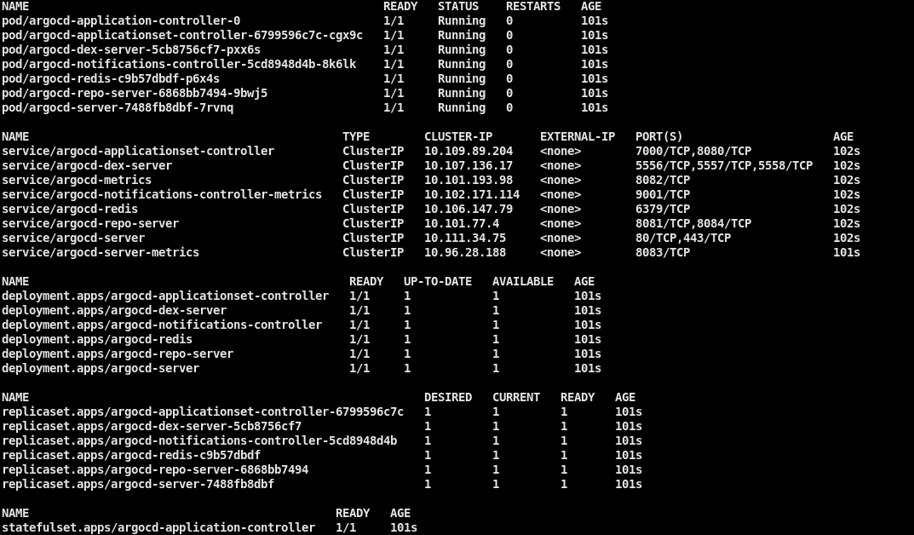
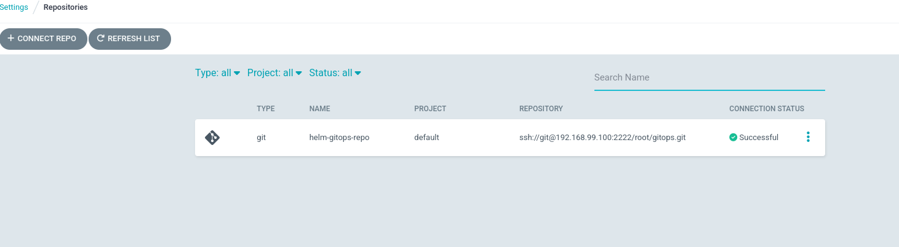
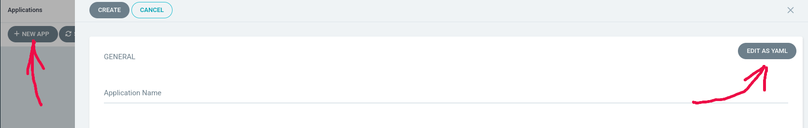
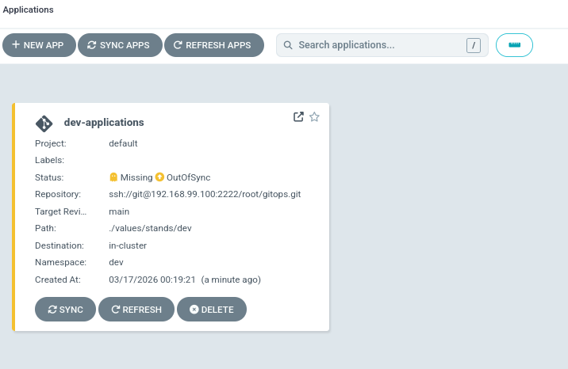
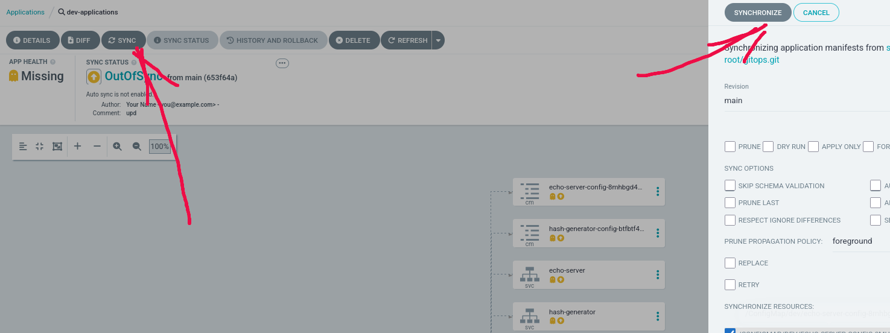
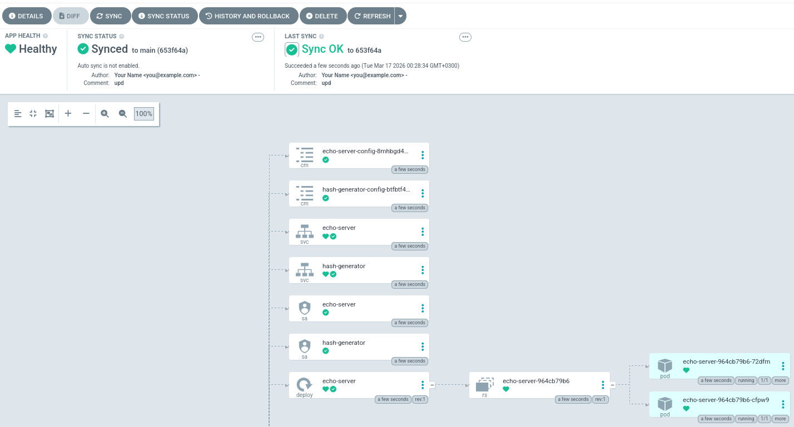
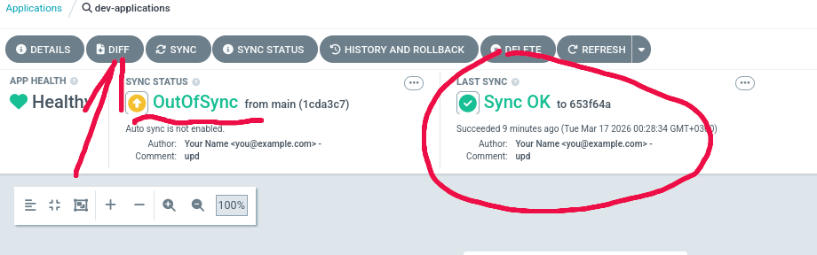
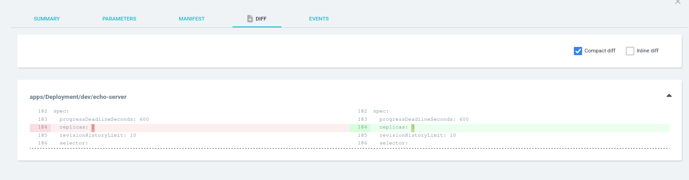
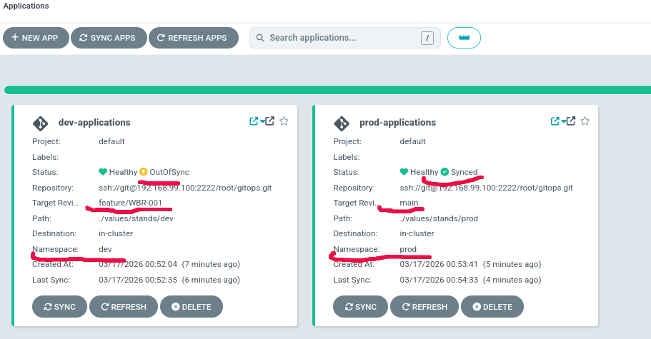

# TODO
# ЛАБОРАТОРНАЯ №6. Continuous Deployment (CD). GitOps. ArgoCD. Kustomize charts

## Docs

* [ArgoCD installation](https://argo-cd.readthedocs.io/en/stable/getting_started/)

# Требования

Развернуть ArgoCD. Создать в нем несколько `application` и запустить в нем свои сервис/сервисы.

# 1)
## Создать и загрузить source helm chart в SCM
Из 5 работы взять `helm chart application`, создать под него отдельный проект и загрузить его в систему контроля версий.
```
Например по такому пути http://192.168.99.100/root/custom-lib
```

## Создать и загрузить gitops репозиторий в SCM
Взять за основу values chart из директории `./gitops`.<br>
Перейти в директорию `./gitops` и добавить submodule на `source helm chart`<br>
Затем загрузить в SCM.
```
$ git submodule add http://192.168.99.100/root/custom-lib.git chart
```
Основная ветка `main`. Дополнительно создать рабочую ветку с названием, например `feature/WBR-001`, чтобы ничего не менять т.к. ветка с этим именем прописана в манифестах.

# 2)
Подключиться по ssh к ВМ master-0.<br>
Перейти в директорию с заданием и выполнить следующие этапы:

## Перейти в рабочую директорию
```
cd ~/work/LAB_6/
```

## Установить необходимые пакеты
```
$ ./scripts/install_pkgs.sh
```

## Создать ns для argocd
```
$ k create ns argocd
```

## Запустить сценарий для подстановки ssh_known_hosts
```
$ ./scripts/ssh_known_hosts_subts.sh
```

## Запустить сценарий для подстановки приватного ключа
```
./scripts/private_key_subst.sh
```

## Установить argocd
```
$ k apply -n argocd --server-side --force-conflicts -k ./argocd/
```

## Проверить статус
```
$ k get -n argocd all
```


## Проверить события (если не запускаются pods)
```
$ k get events -n argocd --sort-by='.lastTimestamp' --watch
```

## Получить пароль из секрета
```
$ ./scripts/obtain_argo_token.sh
```

## Проверить установку ArgoCD

Добавить в /etc/hosts строку

192.168.99.200 argocd.test.local

Перейти по адресу: http://argocd.test.local

Username: `admin`<br>
Password: `из команды выше`

## Проверить, что репозиторий добавился

http://argocd.test.local/settings/repos



## Создать Application

Нажать `new app` ->
Вставить yaml манифест из `./gitops/.application/dev-application.yaml` -><br>
Нажать `save` -><br>
Нажать `create`

## Открыть созданый application и синхронизировать состояние




## Проверить работу gitops репозитория
ArgoCD отслеживает состояние синхронизированных манифестов с теми которые находятся в репозитории.

Если внести изменения в `gitops` репозиторий, загрузить изменения в репозиторий и затем нажать на `refresh` (или подождать), то все изменения, которые могут влиять на текущее состояние будут показаны в `diff`.<br>

Например, если поменять количество реплик, то можно увидеть изменение состояния.




Обычно все стенды кроме `prod` отслеживают состояние какой-нибудь `develop branch` (например`feature/WBR-001`).<br>
Все изменения фиксируется в ней напрямую или через вспомогательные ветки `feature/*`, которые ответвляются от `feature/WBR-001`.<br>
Когда приходит время делать очередной релиз, то из `feature/WBR-001` через `PR` в `release branch` (например `main`), сливаются все изменения и синхронизируем `prod`.<br>
Тем самым мы никак не влияем на релизную ветку на всех других этапах жизни ПО.<br>



Можете также развернуть еще одно `application` с релизной веткой и выполнить какие-нибудь действия.<br>
Например внести измениня в рабочую ветку или изменить `live manifest`, посмотреть `logs` и.т.д.<br>

## Команды для полного удаления ArgoCD (если понадобится)
Само argocd устроено так, что хранит все постоянные данные в `etcd` кластера.<br>
Даже если не удалять созданные `application`, но удалить ArgoCD, они продолжат работу.<br>
После повторного развертывания и создания `application` ArgoCD увидит все эти сервисы и покажет их статус синхронизации с gitops repo.
```
$ k delete -n argocd -k ./argocd/
$ k delete ns argocd
```

## При показе выполненного задания
   * Продемонстрировать настроенные репозитории в SCM
   * Продемонстрировать развернутый ArgoCD с запущенными сервисами

