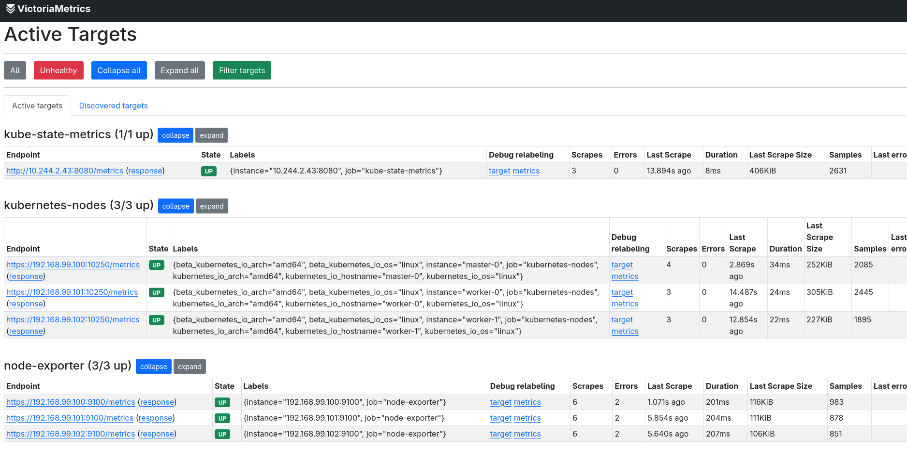
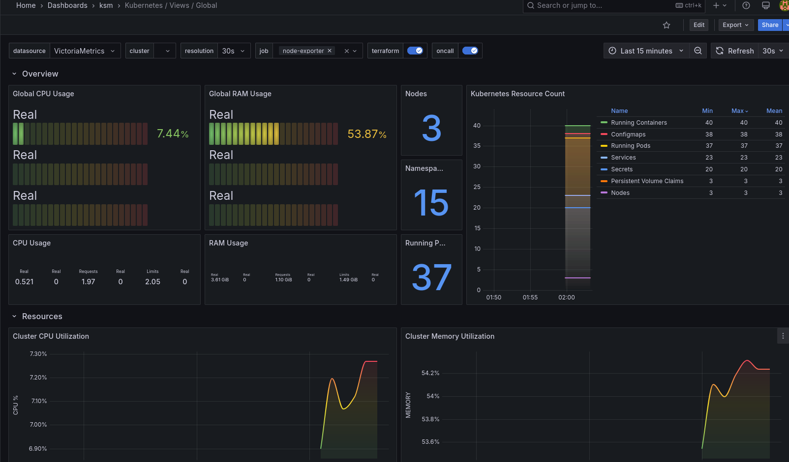
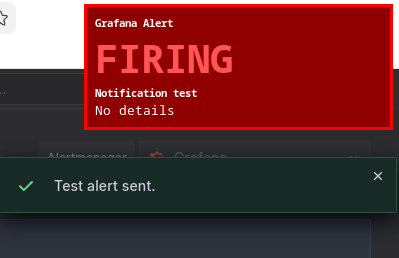
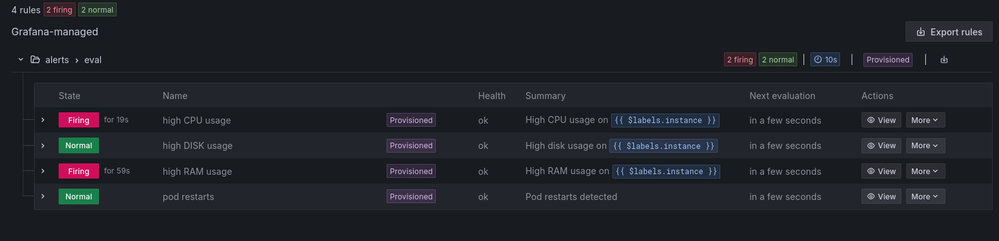
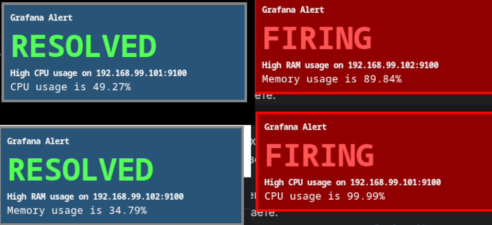

# ЛАБОРАТОРНАЯ №7. Scrape and store мetrics. Visualisation. Notification. (VictoriaMetrics, Exporters, Grafana)

## Docs
* [VictoriaMetrics](https://docs.victoriametrics.com/)
* [Grafana dashboards hub](https://grafana.com/grafana/dashboards/?plcmt=top-nav&cta=downloads&search=dotdc)
* [Grafana dashboards kubernetes](https://github.com/dotdc/grafana-dashboards-kubernetes/tree/master/dashboards)
* [node-exporter](https://github.com/prometheus/node_exporter)
* [Cadvisor](https://github.com/google/cadvisor)
* [kube-state-metrics](https://github.com/kubernetes/kube-state-metrics)

Цель задания настроить базовые действия связанные с метриками:
* сбор
* хранение
* визуализацию
* отправку уведомлений по правилам

Разворачивать инструменты будем в нашем кластере kubernetes.<br>
Подготовлен чарт который развернет стек.<br>
Основные интрументы для работы с метриками:
* exporters
* tsdb
* visualisation tools

Тема достаточно обширная.<br>
Для ознакомления нам будет достаточно двух экспортеров:
* `node-exporter`
* `kube-state-metrics`

Для визуализации возьмем:
* `grafana`

В качестве tsdb:
* `victoriametrics`

## Предварительные действия
Добавить записи в `/etc/hosts`:
```
192.168.99.200 grafana.test.local
192.168.99.200 victoria.test.local
```

Для п.3,4,5 выполнить следующие действия.<br>
Настроить конфигурацию для `contactPoints`, в зависимости от выбранного варианта в п.3.<br>
Для `Webhook` достаточно указать ip:port машины на которой будет запущен обработчик хуков.<br>
Главное требование для любого инструмента, чтобы из пода с grafana был сетевой доступ, туда куда вы планируете отправить уведомления.<br>
Можно зайти в под с `grafana` и проверить, там есть `curl` и `nc` для этого или через UI.

Поправить под себя пороги alerts rules `conditions.evaluator.params` (если сильно будет спамить алертами или наоборот).<br>

Все это править в файле `alerts.yaml`.<br>

Стратегия следующая: поменяли файл -> применили чарт -> перезапустили pod.<br>
Остальное можно не трогать.

## 1) Развернуть стек мониторинга

Подключиться к master-0 и перейти в директорию `LAB_7/helm/monitoring-stack`.<br>
После выполнить команды.

Создать `ns`:
```
$ kubectl create ns monitoring-stack
```

Создать `pv`:
```
$ ./scripts/persistent_volumes.sh createPv
```

Развернуть стек мониторинга:
```
$ helm upgrade --install -n monitoring-stack monitoring-stack .
```

После того как все запустилось, проверить работу инструментов.

Открыть [grafana](http://grafana.test.local)<br>
creds by default:
```
admin
admin
```
Открыть [victoriametrics-targets](http://victoria.test.local/targets)
Если все ок, то `scrape` должен заработать (интервал 10с для node-exporter и 15с для других)


Здесь [victoria-vmui](http://victoria.test.local/vmui) можно делать запросы к tsdb для просмотра метрик, но это неудобно, поэтому будем добавлять `dashboard` и смотреть визуализацию в `grafana`.

## 2) Добавить dashboards

Будем брать готовые.<br>
Для добавления нужно знать ID или json манифест.

[Node exporter full](https://grafana.com/grafana/dashboards/1860-node-exporter-full), создан для визуализации метрик экспортера `node-exporter`, его ID 1860

Открыть [grafana](http://grafana.test.local/dashboards)<br>
Для красоты можно создать отдельные директории со смысловым названием для групп конкретных метрик.<br>
Нажать `New` -> `New folder` -> `node-exporter` -> `create`<br>

Теперь нужно добавить dashboard:<br>
Нажать `New` -> `Import` -> указать 1860 -> `Load` -> `Import`

Откроется дашборд с визуализацией метрик, можно выбрать узел из нашего кластера, интервал рендера графиков.

Могут быть заполнены не все панели, это означает, что часть метрик отсутствует или не совпадает с тем что задано в дашборде.

Добавим еще один, для визуализации состояния кластера:<br>
Нажать `New` -> `New folder` -> `ksm` -> `create`<br>
После импортировать `dashboard` ID 15757
[kubernetes-views-global](https://grafana.com/grafana/dashboards/15757-kubernetes-views-global/), визуализирует метрики `kube-state-metrics` exporter.


Кто хочет, может создать свои дашборды. Но это достаточно скучное занятие, для меня точно.

## 3) Настроить метод получения уведомлений

В примерах есть гайд для `Telegram`, также был добавлен альтернативный вариант для `Webhook`.<br>
Вы также можете взять любой другой вариант, который удобен вам и поддерживается `grafana`.

В файле `grafana/alerts.yaml` созданы базовые правила на отслеживания метрик `CPU`, `RAM`, `FS`.<br>
**Возможно потребуется изменить пороги срабатывания**.

В UI alert rules представлены по адресу:<br>
[GrafanaAlerts](http://grafana.test.local/alerting/list)

Отправить тестовое уведомление можно здесь:<br>
[ContactPoints](http://grafana.test.local/alerting/notifications?search=)

`Create contant point` -> настраиваете способ -> жмете `Test`<br>

Как наcтроили, то добавляете декларативно в блок **contactPoints** `alerts.yaml`.

Для способа `webhook` добавил простейшее приложение, которое обрабатывает входящие REST запросы, выводит их в stdout и отправляет системные уведомления (dunst + libnotify).<br>
Работу уведомлений проверял на графической подсистеме `X11`.<br>
Поддержка `Wayland` у используемых либ есть, но надо проверять.<br>
Тем кто на `macos` или `windows`, можете попробовать написать реализацию под свои графические подсистемы, или обойтись логами в `stdout`.

Установить зависимости.
Debian-based distros:
```
# apt install -y libnotify-bin dunst --no-install-recommends --no-install-suggests
```
Arch-based distros:
```
# pacman -S libnotify dunst
```

Для обработчика вебхуков понадобится `python3` и `flask`:
```
$ pip3 install flask --break-system-packages
```

Скопироавть конфигурацию dunst в `~/.config/dunst`:
```
$ mkdir -p ~/.config/dunst/
$ cp ./webhook-handler/dunst/dunstrc ~/.config/dunst
```

Запустить обработчик вебхуков(понадобится когда будем нагружать систему):
```
$ cd ./webhook-handler
$ ./run.sh
```

## 4) Имитация нагрузки систему

Предварительно поставить утилиты на узлы кластера:
```
# apt install -y stress-ng curl --no-install-recommends --no-install-suggests
```

Подключаетесь к нескольким машинам на выбор `master-0` `worker-0`, `worker-1`, выполняете команды которые будут загружать `RAM`, `CPU`, `FS`, `Network` (только осторожно, чтобы не положить VM).

Load `RAM` (проверьте заранее сколько свободно памяти, чтобы узел не убить):
```
# mkdir -p /tmp/tmpfs && \
  mount -t tmpfs -o size=2G tmpfs /tmp/tmpfs && \
  fallocate -l 500M /tmp/tmpfs/file

# umount /tmp/tmpfs
```

Load `CPU` + `RAM`:
```
$ stress-ng -c 2
$ stress-ng --vm 2 --vm-bytes 512M
```

Load `FS`:
```
$ fallocate -l 10G /mnt/largefile # rm /mnt/largefile
```

Load `Network`:
```
$ curl -o /dev/null https://mirror.yandex.ru/linuxmint/stable/22.3/linuxmint-22.3-mate-64bit.iso
```

## 5) Проверка метрик, отправки уведомлений

Во время нагрузочных тестов открыть `dashboard` `node-exporter`, выбрать узел кластера который подвергается нагрузке.<br>
Запустить обработчик хуков или другой вариант, который будет принимать запросы от сервера уведомлений `grafana`.<br>
Будет видно, как изменяется состояние тех компонентов узла, которые нагружаете.<br>
Параллельно можете отслеживать статусы [GrafanaAlerts](http://grafana.test.local/alerting/list).<br>

Спустя некоторое время сработает alert, по тем порогам которые указаны в конфигурации.

Если все настроено правильно, `grafana` сервер отправит уведомления на тот способ, который вы настроили.
Если используете предложенный вриант из репозитория, то примерно следующий вид будет:

```log
[FIRING] high CPU usage:
High CPU usage on 192.168.99.101:9100
CPU usage is 99.98%
WARNING: Icon 'dialog-error' not found in icon_path
192.168.99.101 - - [01/Apr/2026 02:30:45] "POST /alerts HTTP/1.1" 200 -

[FIRING] high RAM usage:
High RAM usage on 192.168.99.102:9100
Memory usage is 90.19%
WARNING: Icon 'dialog-error' not found in icon_path
192.168.99.101 - - [01/Apr/2026 02:30:10] "POST /alerts HTTP/1.1" 200 -

[RESOLVED] high RAM usage:
High RAM usage on 192.168.99.102:9100
Memory usage is 34.79%
WARNING: Icon 'dialog-information' not found in icon_path
192.168.99.101 - - [01/Apr/2026 02:30:25] "POST /alerts HTTP/1.1" 200 -

[RESOLVED] high CPU usage:
High CPU usage on 192.168.99.101:9100
CPU usage is 49.27%
WARNING: Icon 'dialog-information' not found in icon_path
192.168.99.101 - - [01/Apr/2026 02:31:00] "POST /alerts HTTP/1.1" 200 -
```

## Очистка установленного стека

Если потребуется полная переустановка (будут потеряны собранные метрики):

Остановить стек мониторинга:
```
$ helm uninstall -n monitoring-stack monitoring-stack
```
Дождаться, что все поды остановились.

`node-exporter` может подвиснуть по некоторым причинам.<br>
Поэтому определить узел на котором он завис:
```
$ k get -n monitoring-stack pod -o wide
```
После сделать `force reboot` узла.

Удалить `pvc` и `pv`:
```
$ ./scripts/persistent_volumes.sh deletePv
```

Удалить `ns`:
```
$ k delete ns monitoring-stack
```


## При показе выполненного задания
* Подключиться к рабочим узлам и запустить команды для имитации нагрузки на сервер.
* Показать изменение состояния в `grafana`.
* Показать работу сервера нотификации. Должны получить `уведомление` или payload в `stdout` в котором будет указана информация об узле и о нагружаемом компоненте системы `FS`, `RAM`, ...

